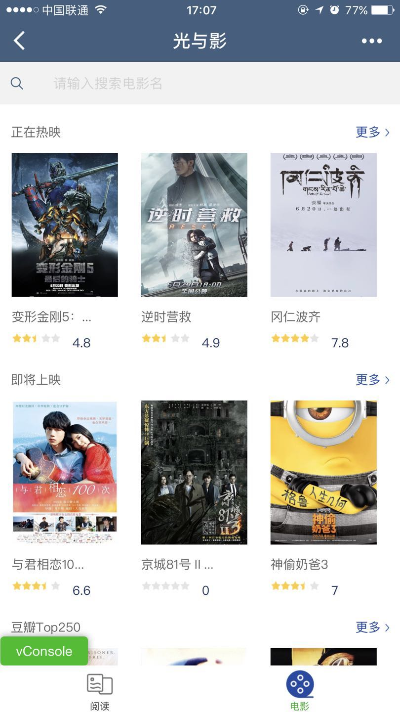
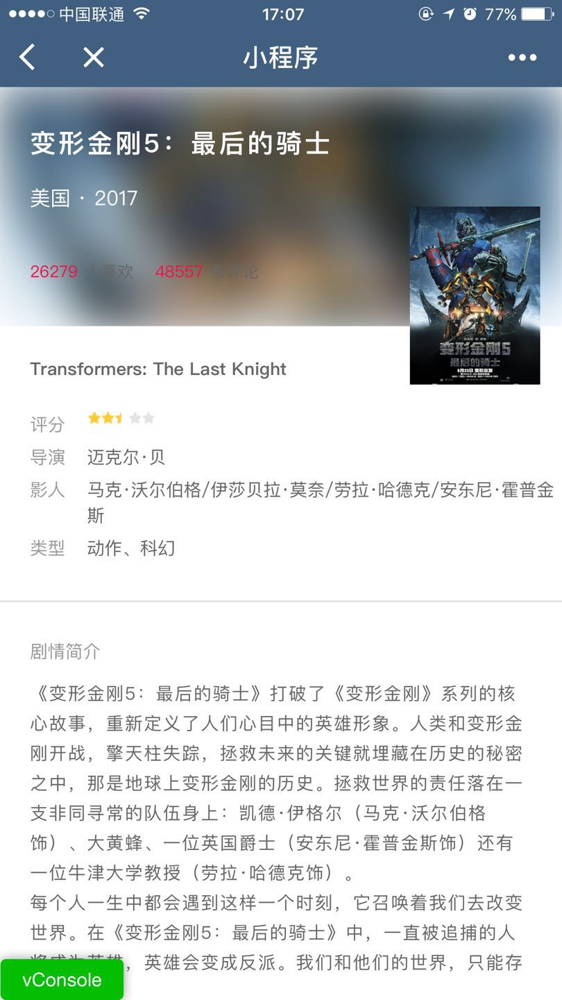

# 小程序
学习小程序实战。来源于慕课网。
# 学习笔记
具体参照官网。

# 展示
#### 首页

#### 文章列表页

#### 文章详情页

#### 电影列表页

#### 电影分类列表页

#### 电影详情页

# 参考资料
> [微信小程序开发官网](https://mp.weixin.qq.com/debug/wxadoc/dev/)
> 
> [微信小程序入门与实战 常用组件 API 开发技巧 项目实战](http://coding.imooc.com/class/75.html)
